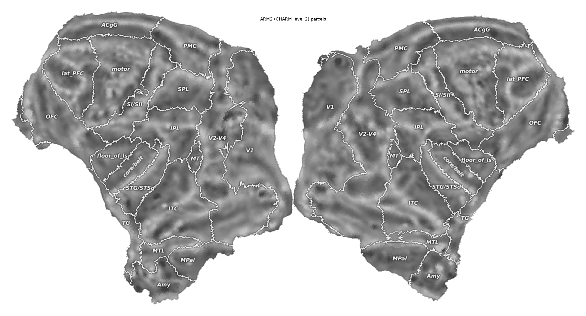

# monkey-flatmap-autogen

Automatic cortical flat maps for macaque brains from FreeSurfer-format surfaces: anatomical cuts placed by landmark rules, distance-preserving flattening (uniform Tutte embedding followed by SLIM), quality gates, a canonical orientation, and import into pycortex with parcel outlines. The package is called `mfa` both as a Python module and as a command-line tool.

The input is a FreeSurfer-format subject: a white surface, a `cortex.label` marking the cortical sheet, and a parcellation that names the landmark regions (CHARM level 2, or any other parcellation mapped onto those names). From this the package computes three cut paths per hemisphere (calcarine, frontal, temporal) as sulcus-preferring shortest paths between anatomical landmarks, removes the vertices along those paths together with the medial wall so that the hemisphere becomes a topological disk, flattens the disk with a bijective Tutte embedding followed by SLIM, checks the result against topological and distortion gates, rotates it into a canonical "butterfly" frame, and imports it into pycortex.

The cut paths follow a *recipe* of landmark rules that is identical for every hemisphere of every subject, so that maps of different animals are cut through the same anatomical structures and stay comparable. The only per-hemisphere parameter is the slit width (how many vertex rings are removed along each cut), chosen automatically as the narrowest width that passes every gate. The package also contains the joint search that selects such a recipe over several subjects, tools to compare parcel layouts across hemispheres and subjects, a writer that draws any FreeSurfer annotation as outlines and labels into pycortex's `overlays.svg`, and a resampler that turns a volumetric label atlas into a surface annotation.



*Both hemispheres of one subject after `mfa apply` and `mfa overlay-parcels`: curvature shading with CHARM level-2 parcel outlines and labels. A finer level of the same atlas drawn as its own layer is in `img/example_flatmap_parcels_level3.png`.*

## Features

- `mfa flatten`: computes the cut paths (calcarine, frontal, temporal; an optional cingulate cut) from the recipe, builds the cut patch, flattens it with SLIM, orients it, and checks the gates: one boundary loop, no isolated vertices, one connected component, zero flipped triangles, a successful orientation fit, and no local area concentration (the "swirl" detector). With `--slit-width auto` it tries widths 1, 2 and 3 and keeps the narrowest that passes. Writes QC figures and a record of the gates.
- `mfa apply`: promotes a design that passed the gates to the subject's canonical `flatten` patches, creates the pycortex subject if needed, imports the flat surfaces and regenerates `overlays.svg`, with timestamped backups of everything it overwrites.
- `mfa tune-joint`: searches for one cut recipe over all hemispheres of several subjects. Candidate recipes are first screened without flattening, then flattened in stages and scored on distortion, left-right silhouette agreement, cross-subject parcel layout, and which side of the temporal cut the adjacent parcels fall on.
- `mfa reference`, `mfa compare`: save a subject's parcel layout as a reference, and compare layouts across hemispheres or subjects (similarity alignment, parcel centroid displacement, Dice overlap, seam-side agreement) with overlay figures and tables.
- `mfa overlay-parcels`: draws a FreeSurfer annotation into `overlays.svg` as outlines and labels, with labels placed in the interior of each parcel, rotated along elongated parcels, and slivers folded into their main piece so that pycortex does not label them separately. Can also render the result.
- `mfa atlas-annot`: resamples a volumetric label atlas onto the surface by a majority vote over several cortical depths and writes an `.annot` file.
- `mfa qc`: metrics and figures for existing patches. `mfa import-subject`: FreeSurfer subject to pycortex subject.
- Deterministic: the same cut patch gives the same flat coordinates on every run, bit-identical when the BLAS thread count is fixed.

## Installation

Python >= 3.10. A conda environment is the easiest way to get pycortex's dependencies:

```bash
conda create -n flatmap python=3.11 numpy scipy matplotlib lxml shapely h5py
conda activate flatmap
pip install libigl                                        # SLIM (libigl >= 2.6 python bindings)
pip install "git+https://github.com/gallantlab/pycortex.git"   # for apply / overlays / atlas
pip install -e .                                          # this package
```

pycortex is needed only by `mfa apply`, `mfa import-subject`, `mfa overlay-parcels` and `mfa atlas-annot`; cutting, flattening, QC and comparison need only numpy, scipy, nibabel, matplotlib and libigl. pycortex renders the `overlays.svg` layers through **Inkscape**: set its path in `~/.config/pycortex/options.cfg` (`[dependency_paths] inkscape = ...`) together with the pycortex database folder (`[basic] filestore = ...`). To run the tests: `pip install -e .[test] && pytest`.

## Quick start

```bash
export SUBJECTS_DIR=/path/to/freesurfer_subjects        # holds <subject>/surf and <subject>/label
export OMP_NUM_THREADS=4 OPENBLAS_NUM_THREADS=4 MKL_NUM_THREADS=4   # fixed thread count = reproducible bits
mfa flatten --subject sub-01 --name uc --slit-width auto --out-dir out   # cut + flatten both hemispheres
mfa qc      --subject sub-01 --name uc --out-dir out                     # metrics, hotspot maps, butterfly
mfa apply   --subject sub-01 --name uc --pycortex-subject s01 --out-dir out   # promote + import into pycortex
mfa overlay-parcels --subject sub-01 --pycortex-subject s01 --render out/sub-01_uc/parcels.png
mfa compare --subjects sub-01 sub-02 --out-dir out                     # once a second subject is promoted
```

`examples/run_new_subject.sh` is the same sequence with placeholders; `examples/example_api.py` does one hemisphere from Python.

## Input format

A standard FreeSurfer subject directory: `$SUBJECTS_DIR/<subject>/surf/{lh,rh}.{white,pial,inflated,curv,sulc}`, `label/{lh,rh}.cortex.label`, and a parcellation `label/{lh,rh}.aparc.ARM2atlas.mapped.annot` whose parcel names are those of CHARM level 2. Any other parcellation can be used instead by passing `--annot` and mapping its parcel names onto the required ones with `--parcel-map`. The medial wall is defined as everything outside `cortex.label`.

Any pipeline that writes FreeSurfer-format surfaces, a cortex label and such a parcellation can produce the input. [brainana](https://github.com/brainana) writes exactly this layout for macaque data and is what the package was developed with. The required parcel names and the coordinate conventions are listed by `mfa flatten --help`; a full write-up will be added with a later release.

## Method

Each cut is a shortest path on the white surface (Dijkstra, with a lower cost inside sulci) between two landmarks. Landmarks are defined only by parcel membership and by anterior-posterior or dorsal-ventral ordering, so they are mirror-symmetric between hemispheres and do not depend on the subject. The vertices along each path are removed as a slit that reaches the outer boundary of the cortical sheet; together with the removal of the medial wall this turns the hemisphere into a single disk-shaped patch, which is verified before flattening. The patch is flattened by a uniform-weight Tutte embedding onto a disk of matching area (which cannot fold) followed by SLIM, which minimises the symmetric Dirichlet distortion energy without introducing folds. Finally the flat patch is rotated by orthogonal Procrustes so that it matches the hemisphere's lateral view, and the left hemisphere is mirrored so that the two hemispheres form the usual butterfly with the occipital poles at the midline.

The quality gates and metrics, the slit-width policy, the joint recipe search and its score, the seam-side definitions used in comparisons, the overlay writer and the atlas resampler will be described in a methods document with a later release. Until then `mfa <subcommand> --help` and `examples/run_new_subject.sh` are the reference.

## Outputs

| where | what |
|---|---|
| `$SUBJECTS_DIR/<subject>/surf/<hemi>.<name>.patch.3d` | the cut patch (kept vertices, border flags, 3D coordinates) |
| `$SUBJECTS_DIR/<subject>/surf/<hemi>.<name>.flat.patch.3d` | the flat patch in the canonical frame (`z = 0`) |
| `.../<hemi>.<name>_autow<w>.*` | the width attempts of `--slit-width auto` (kept for cheap re-runs) |
| `<out-dir>/<subject>_<name>/chosen.json` | route, slit width per hemisphere, gates, metrics, silhouette, reproduce / apply commands |
| `<out-dir>/<subject>_<name>/run.json`, `<hemi>_qc.png` | run record and QC figures |
| `<out-dir>/<subject>_<name>/final_flatmap_<cx>.png` | rendered flat map after `mfa apply` |
| `.../<hemi>.flatten.*`, `<filestore>/<cx>/surfaces/flat_*.gii`, `overlays.svg` | canonical patches, pycortex flat surfaces and overlays (previous versions backed up as `*.pre<name>.<stamp>.bak`) |
| `<out-dir>/joint_tune/` | `prescreen.tsv`, `recipe_results.tsv`, `results.json`, `chosen_recipe.json`, `cut_recipe.json`, `report.png`, `seam3d.png`, `overlay_*.png`, `comparison.md` |
| `<out-dir>/compare/` | comparison tables and overlay figures of `mfa compare` |

## Methods it builds on

- Rabinovich M, Poranne R, Panozzo D, Sorkine-Hornung O (2017). Scalable Locally Injective Mappings. *ACM Transactions on Graphics* 36(2):16. (SLIM, used through libigl)
- Gao JS, Huth AG, Lescroart MD, Gallant JL (2015). Pycortex: an interactive surface visualizer for fMRI. *Frontiers in Neuroinformatics* 9:23.
- Jung B, Taylor PA, Seidlitz J, Sponheim C, Perkins P, Ungerleider LG, Glen D, Messinger A (2021). A comprehensive macaque fMRI pipeline and hierarchical atlas. *NeuroImage* 235:117997. (CHARM parcellations)
- Liu X, Zhang Y, Yin Z, Zhen Z, Arcaro MJ (2026). Brainana: an end-to-end preprocessing framework for macaque neuroimaging. *bioRxiv* 2026.06.03.729972. https://doi.org/10.64898/2026.06.03.729972 (the pipeline that produced the input surfaces and parcellations this package was developed with)
- Fischl B (2012). FreeSurfer. *NeuroImage* 62(2):774-781.
